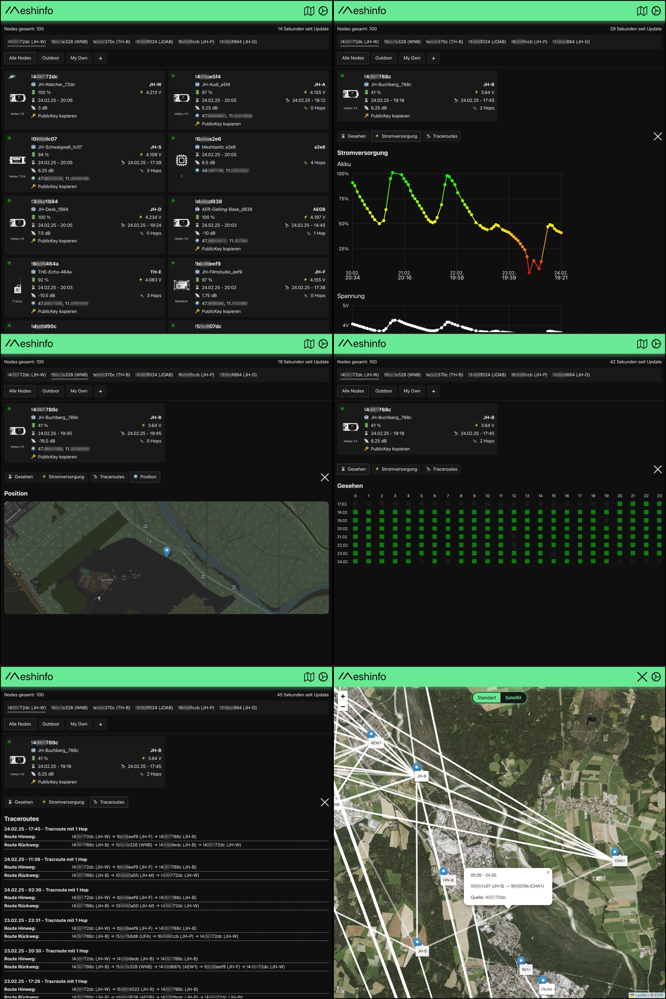

# meshinfo [Frontend]
##### This is the frontend part of the project, which visualizes the data on the web server with Vue.js.
> **Note:** The frontend relies on data provided by the server component, making the server part essential for the proper functioning of this project.

Click [here](https://github.com/jhodevstuff/meshinfo) for the server part (collecting & uploading node data).

A versatile dashboard that displays the current status of your Meshtastic network:

- **Node list with all important information**
  - Node ID
  - Node name (long & short)
  - Power and battery info
  - Signal strength, hops, and last seen
  - GPS coordinates with a Google Maps link
  - Public Key
- **Detailed view of collected data within a certain time period**
  - Overview of battery/voltage level, traceroutes, online-state and position map preview
- **Map**
  - Node map
  - Visulized traceroutes
  - Detailed infos
- **Configurable views**
  - Detailed or compact view
  - Sort the nodes
  - Add filters to only see specific nodes
- Multiple master nodes can provide their data in a single dashboard



### Installation
1. Clone the repository: `git clone https://github.com/jhodevstuff/meshinfo-fe.git`
2. Go to the directory: `cd meshinfo-fe`
3. Install the Node modules: `npm install`

**Note:** Make sure you have the latest Node.js (node & npm) installed!

### Local (Development) Web Server
- Start the local (dev) web server: `npm run dev`
- Open `http://localhost:5173/` in your browser

### Deployment on a Web Server
- Ensure that `vite.config.js` contains the correct base path for your web server (default `/`)
- Delete any sample data from the project (`nodesindex.json`, `meshdata_!435772dc.json`)!
- Build the project: `npm run build`
- Copy the following files/folders to your web server:
  - Everything from the `dist` folder (`index.html`, etc.)
  - From the project’s root directory: `robots.txt`, `.htaccess`, `maplink.json`
  - The `src` folder

It should look something like this:

```
./assets
./src
.htaccess
favicon.ico
index.html
maplink.json
```
Congratulations! Hope it works!

### Future Plans of the Developer
- Currently, the language is German, but an English option is planned
- Password protection for access (at this moment the sensible data can be unlocked by clicking the logo 5 times)
- Possibly remote administration
- Importance score for each node in the network
- User notification when a node goes offline (monitoring script is in testing)

###### Joshua Hoffmann / 2024-02-24